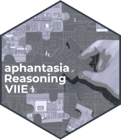

<!-- README.md is generated from README.Rmd. Please edit that file -->

# aphantasiaReasoningViie <a href="https://m-delem.github.io/aphantasiaReasoningViie/"></a>

<!-- badges: start -->

[](https://osf.io/hfbcp/)
[](https://app.codecov.io/gh/m-delem/aphantasiaReasoningViie)
<!-- badges: end -->

aphantasiaReasoningViie is a data analysis project disguised as an R
package. It contains the code and data to reproduce the analyses
presented in the paper “*The Impact of Mental Images on Reasoning: A
Study on Aphantasia*”. You can read the preprint
[here](https://doi.org/10.31234/osf.io/vsjtb_v1).

The R package structure was chosen to facilitate the sharing of the code
and data with the scientific community, and to make it easy to reproduce
the analyses. It is not intended to be a general-purpose package, but
rather a collection of functions and data specific to this study
(although many functions are reusable in their own right). The package
development workflow (see [this reference book](https://r-pkgs.org/)) is
also a good way to ensure that the code is well-documented and tested,
which is important for reproducibility in scientific research.

## Installation

The code to install the development version of aphantasiaReasoningViie
is the following:

``` r
# install.packages("pak")
pak::pak("m-delem/aphantasiaReasoningViie")
```

Alternatively, you can clone the repository, launch the R project in
RStudio by opening the `aphantasiaReasoningViie.Rproj` file and run the
following command:

``` r
devtools::load_all()
#> ℹ Loading aphantasiaReasoningViie
#> Welcome to aphantasiaReasoningViie.
```

… Which will load the package and make all its functions and data
available in your R session.

The online documentation of the package contains detailed articles
describing:

- [The power analyses by
  simulation](https://m-delem.github.io/aphantasiaReasoningViie/articles/power_analysis.html)

- [The data processing
  steps](https://m-delem.github.io/aphantasiaReasoningViie/articles/preparing_data.html)

- [The creation of the cognitive style clusters used in the
  analyses](https://m-delem.github.io/aphantasiaReasoningViie/articles/osivq_clusters.html)

- [The accuracy
  analyses](https://m-delem.github.io/aphantasiaReasoningViie/articles/analysing_accuracy.html)

- [The response time
  analyses](https://m-delem.github.io/aphantasiaReasoningViie/articles/analysing_rt.html)

- [The strategies
  analyses](https://m-delem.github.io/aphantasiaReasoningViie/articles/analysing_strategies.html)

- [The exploratory non-linear RT
  models](https://m-delem.github.io/aphantasiaReasoningViie/articles/nl_modelling.html)
